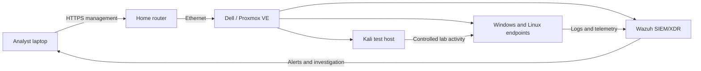

# SOC Homelab

A defensive security homelab built on Proxmox VE for SOC monitoring, detection engineering, incident investigation, and incident response practice.

> **Project status:** In progress — hypervisor deployed, monitoring stack planned.

## Project goals

- Build a reproducible virtualized SOC environment.
- Collect and analyze Windows and Linux endpoint telemetry.
- Deploy Wazuh as the central SIEM/XDR platform.
- Practice alert triage, investigation, detection tuning, and reporting.
- Safely generate test events inside an isolated lab network.
- Document design decisions, implementation steps, validation, and troubleshooting.

## Current status

- [x] Installed Proxmox VE 9.2.x on an Intel-based Dell host
- [x] Configured static management networking
- [x] Enabled the official no-subscription repository
- [x] Updated the Proxmox host
- [x] Validated remote web management
- [ ] Deploy Ubuntu Server 24.04 LTS
- [ ] Install the Wazuh all-in-one stack
- [ ] Deploy Windows and Linux monitored endpoints
- [ ] Create an isolated virtual lab network
- [ ] Add Kali Linux for controlled security testing
- [ ] Build and document detection scenarios

## Planned architecture

The endpoint and test systems will later be moved to an isolated Proxmox bridge. The Wazuh dashboard and Proxmox management interface will remain reachable only from the trusted home network.

## Planned virtual machines

| System | Role | vCPU | RAM | Storage |
|---|---|---:|---:|---:|
| Wazuh on Ubuntu Server 24.04 | SIEM, indexing, alerting, dashboard | 4 | 8 GB | 50–80 GB |
| Windows endpoint | Windows telemetry, Sysmon, Wazuh agent | 2 | 4 GB | 64 GB |
| Ubuntu endpoint | Linux logs, audit and Wazuh agent | 1–2 | 2 GB | 25 GB |
| Kali Linux | Controlled event generation | 2 | 2–3 GB | 35–40 GB |

Because the host has 16 GB of RAM, only the machines required for a given exercise will run at the same time.

## Documentation

- [Project scope](docs/01-project-scope.md)
- [Hardware and resource plan](docs/02-hardware-and-resources.md)
- [Network design](docs/03-network-design.md)
- [Proxmox build record](docs/04-proxmox-build.md)
- [Implementation roadmap](docs/05-roadmap.md)
- [Change log](CHANGELOG.md)

## Safety

This environment is intended exclusively for authorized defensive-security education. Test activity will be limited to systems owned by the lab operator and placed inside the isolated lab network. No lab service will be exposed directly to the public Internet.

## Repository policy

Secrets, credentials, private keys, VM images, ISO files, and sensitive screenshots are excluded from this repository. Screenshots are reviewed and cropped before publication.
