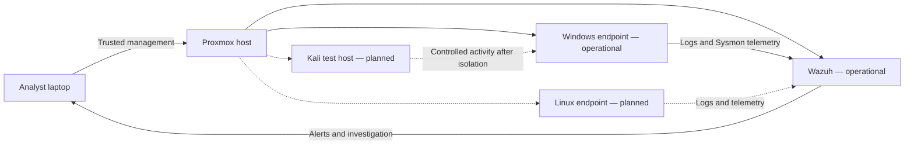

# SOC Homelab

A defensive security homelab built on Proxmox VE for SOC monitoring, detection engineering, incident investigation, and incident response practice.

> **Project status:** In progress — the Wazuh platform and one Windows endpoint are operational. Sysmon collection and the first custom detection case have been validated. Network isolation, enhanced PowerShell logging, Linux telemetry, and a Kali test host remain planned.

## Project goals

- Build a reproducible virtualized SOC environment.
- Collect and analyze Windows and Linux endpoint telemetry.
- Deploy Wazuh as the central SIEM/XDR platform.
- Practice alert triage, investigation, detection tuning, and reporting.
- Safely generate test events inside an isolated lab network.
- Document design decisions, implementation steps, validation, and troubleshooting.

## Current status

- [x] Installed and updated Proxmox VE
- [x] Configured and validated management networking
- [x] Created and validated the Ubuntu-based Wazuh VM
- [x] Installed and validated Wazuh 4.14.7 all-in-one
- [x] Enabled automatic startup and created recovery points
- [x] Created and fully updated a Windows 11 Enterprise evaluation endpoint
- [x] Installed and enrolled Wazuh Agent 4.14.7
- [x] Installed Sysmon 15.21 and enabled collection of its Operational channel
- [x] Validated a custom command-shell detection mapped to MITRE ATT&CK
- [x] Completed the first documented alert-triage case
- [ ] Normalize endpoint naming and revalidate after reboot
- [ ] Enable and validate enhanced PowerShell logging
- [ ] Create an isolated virtual lab network
- [ ] Add a Linux endpoint when capacity permits
- [ ] Add Kali Linux after isolation and capacity checks are complete

## Target architecture

The diagram below represents the **planned target**, not a list of systems already installed. Kali Linux is not currently deployed.

Kali will be introduced only after the endpoint network is isolated and host capacity has been reviewed. Its role will be limited to authorized activity against lab-owned targets.

## Resource strategy

The lab runs on a single resource-constrained host. Only systems required for the active exercise are powered on, and future guests depend on measured capacity rather than storage or memory overcommit assumptions.

## Documentation

- [Project scope](docs/01-project-scope.md)
- [Hardware and resource plan](docs/02-hardware-and-resources.md)
- [Network design](docs/03-network-design.md)
- [Proxmox build record](docs/04-proxmox-build.md)
- [Implementation roadmap](docs/05-roadmap.md)
- [Wazuh VM build record](docs/06-wazuh-vm-build.md)
- [Wazuh installation record](docs/07-wazuh-installation.md)
- [Windows endpoint build record](docs/08-windows-endpoint.md)
- [Detection case 001 — Sysmon command shell](docs/09-sysmon-command-shell-case.md)
- [Change log](CHANGELOG.md)

## Safety

This environment is intended exclusively for authorized defensive-security education. Test activity is limited to systems owned by the lab operator. No lab service will be exposed directly to the public Internet.

## Repository policy

Credentials, keys, private addresses, MAC addresses, internal identifiers, administrative paths, VM images, ISO files, and raw screenshots are excluded. Evidence is summarized or sanitized before publication.

