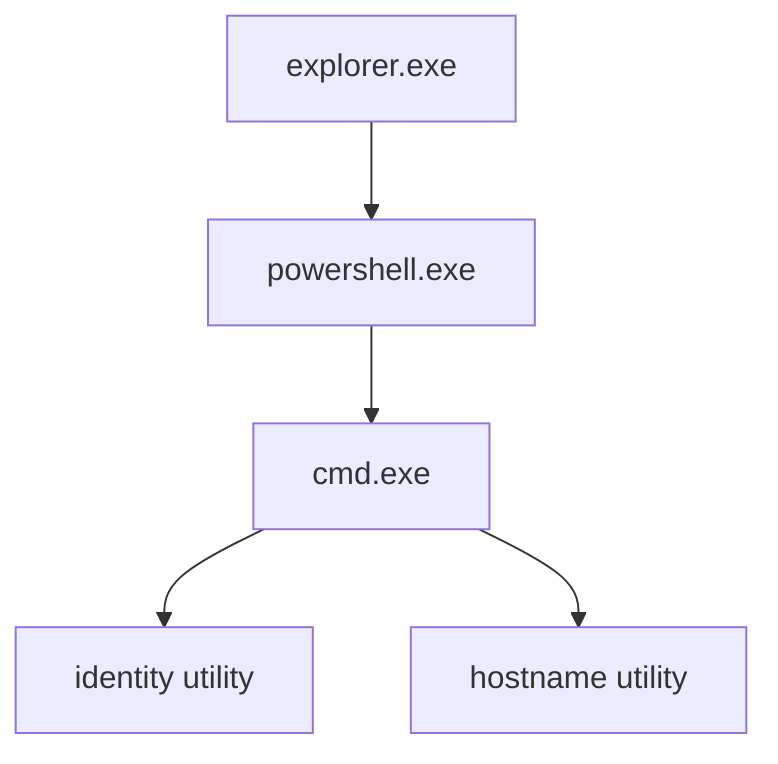

# Detection case 001 — Sysmon command-shell execution

## Case summary

| Field | Value |
|---|---|
| Case ID | `SOC-DET-001` |
| Endpoint | Sanitized Windows endpoint alias |
| Data source | Microsoft Sysmon Operational channel |
| Event type | Sysmon Event ID 1 — Process Create |
| Detection | Local Wazuh rule, level 5 |
| Related detection | Built-in suspicious command-shell rule |
| MITRE ATT&CK | `T1059.003` — Windows Command Shell |
| Final disposition | True positive, authorized benign test |
| Case status | Closed |

## Objective

Validate the complete path from a Windows process launch through Sysmon and Wazuh Agent to a searchable Wazuh alert, then perform basic triage and reconstruct the process tree.

## Detection logic

A manager-side custom rule was linked to the standard Sysmon process-creation ruleset. It searched the command-line field for a unique lab-only marker, assigned a moderate alert level, and mapped the result to MITRE ATT&CK `T1059.003`.

Before activation, the local rule identifier was checked for conflicts, the rules file was backed up, duplicate entries were removed, and the final configuration passed the Wazuh validation test. Exact local identifiers and administrative file paths are omitted.

## Controlled test

An elevated PowerShell session launched the Windows command processor. The test performed only local identity and hostname discovery and printed the unique lab marker. It made no persistence, privilege, network, or security-control changes.

## Alert evidence

Wazuh Threat Hunting returned the expected custom-rule hit for the fresh test event.

| Evidence | Observation |
|---|---|
| Data source | Sysmon Process Create |
| Executable | Expected Windows command processor in its standard system location |
| Vendor metadata | Microsoft Corporation |
| Command-line behavior | Local identity discovery, hostname discovery, and the unique lab marker |
| Integrity level | Elevated |
| Custom alert | Expected description and moderate severity |
| Related alert | Built-in suspicious command-shell detection |
| Hash telemetry | Multiple hash formats were available; values were not published |

Private addresses, local accounts, timestamps tied to the private session, rule and agent identifiers, transient process IDs, and raw event JSON are intentionally excluded.

## Process-tree reconstruction

The indexed document contained a parent process reference but did not populate the parent image. A narrowly scoped, read-only live query on the endpoint resolved the missing context.

The sequence is consistent with a user opening an elevated PowerShell console from an interactive Windows session and launching the controlled test.

## Analyst assessment

### Supporting facts

- The event was generated during an authorized lab exercise.
- Executable location and vendor metadata matched the expected Windows component.
- The command-line behavior matched the documented test objective.
- The parent chain led back to the interactive Windows shell.
- No persistence, external connection, credential access, or destructive action was present.

### Disposition

**True positive, authorized benign test.** The detection correctly reported activity that occurred. It is not a false positive merely because the activity was benign. No containment or remediation was required, and the case was closed as a successful validation.

## Lessons learned

1. The end-to-end telemetry and alerting path is operational.
2. A dedicated marker makes an initial custom-rule test deterministic.
3. Built-in and custom rules can provide complementary context.
4. Missing indexed fields can be enriched with narrow read-only endpoint queries.
5. Endpoint naming should remain consistent across the OS, agent, and documentation.
6. Raw screenshots and event JSON require sanitization before publication.

## Next actions

- Normalize endpoint naming and revalidate connectivity after reboot.
- Enable enhanced PowerShell logging and confirm its telemetry.
- Confirm a current post-Sysmon recovery point.
- Build additional local detection cases before introducing Kali.
- Deploy Kali only after network isolation and capacity checks are complete.
